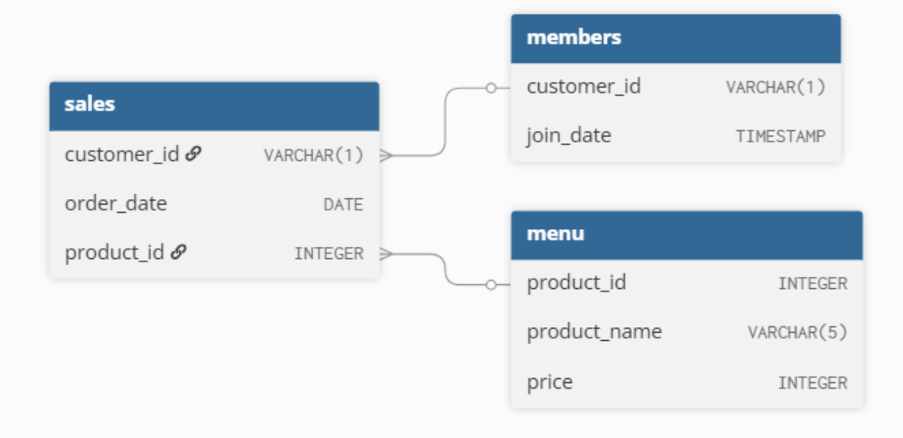

# Case Study #1: Danny's Diner
Customer Analytics & Loyalty Insight Project

**Project Purpose:**
The goal of this project is to act as a Lead Data Analyst for a start-up restaurant. Danny needs assistance using his transaction data to answer three core business questions:
1. Customer Behavior: How often do they visit and what are their spending patterns?
2. Product Strategy: Which menu items are driving the most engagement?
3. Loyalty Impact: Is the new membership program actually influencing customer behavior?
By using T-SQL, I transformed raw tables into actionable insights that Danny can use to decide whether to expand the existing loyalty program.

**Technical Stack:**
1. Engine: Microsoft SQL Server (T-SQL);
2. Key Techniques: CTEs, Window Functions (DENSE_RANK), Joins and CASE Statements.

**Business Conclusions & Insights:**
1. The "Ramen" Hook: Ramen is the primary acquisition tool; it is almost always a customer's first order.
2. Loyalty Potential: Customer B is the most "profitable" loyalist, specifically targeting high-point items (Sushi).
3. Retention Risk: Customer C shows low engagement and is at risk of churning, requiring a targeted re-engagement strategy.

[View the full T-SQL Solution here](Case_Study_1_(Danny's_Diner).sql)

[Connect with me on LinkedIn](https://www.linkedin.com/in/purti1003/)

#  Danny's Diner SQL Analysis

## Project Overview
Danny's Diner is a small Japenese restaurant selling three items - sushi, curry and ramen. Danny captured a few months of transaction data but had no way to make sense of it. The ask was straightforward: help him understand his customers well enough to decide whether to double down on the loyalty program and build datasets his team could use without touching SQL themselves.

This is Case Study #1 from Danny Ma's [8 Week SQL Challenge](https://8weeksqlchallenge.com/case-study-1/). Solved entirely in T-SQL.

## Entity Relationship Diagram



## Questions Answered

### Core Analysis (10 Questions)

#### 1. What is the total amount each customer spent at the restaurant?

Simple join between sales and menu, grouped by customer.

```sql
	SELECT s.customer_id, SUM(m.price) AS total_spent
	FROM sales s
	INNER JOIN menu m ON s.product_id = m.product_id
	GROUP BY s.customer_id;
```

  *Analysis - Customer A & B are primary drivers of the revenue, representing highest total spendings while customer C's contribution to the revenue is quite low.*


#### 2. How many days has each customer visited the restaurant?

Used `COUNT(DISTINCT order_date)` - a deliberate choice over `COUNT(*)` to avoid double counting same day multiple orders as separate visits

```sql
 	SELECT customer_id, COUNT(DISTINCT order_date) AS days_visited
 	FROM sales
	GROUP BY customer_id;
```
  
  *Analysis: Customers A & B are more frequent visitors compared to Customer C, who has visited only twice. This aligns with previous observation regarding contribution to revenue.*


#### 3. What was the first item from the menu purchased by each customer?

Used `DENSE_RANK()` over order_date partitioned by customer. Also built an alternate presentation using `STRING_AGG()` to handle cases where a customer ordered multiple items on the same first day.

```sql
	WITH cte AS
	(SELECT s.customer_id, m.product_name, DENSE_RANK() OVER(PARTITION BY s.customer_id ORDER BY order_date) AS rn 
    FROM sales s
    INNER JOIN menu m ON s.product_id = m.product_id)

    SELECT customer_id, product_name
    FROM cte
    WHERE rn = 1
    GROUP BY customer_id, product_name;
```
 
 Alternate Presentation

```sql
	WITH cte AS
    (SELECT DISTINCT s.customer_id, m.product_name, DENSE_RANK() OVER(PARTITION BY s.customer_id ORDER BY order_date) AS rn 
    FROM sales s
    INNER JOIN menu m ON s.product_id = m.product_id)

    SELECT customer_id, STRING_AGG(product_name, ', ') as first_ordered_products
    FROM cte
    WHERE rn = 1
    GROUP BY customer_id;
```

*Analysis: Customer A ordered Curry and Sushi for their first order while Customer B ordered only curry and Customer C ordered Ramen.*


#### 4. What is the most purchased item on the menu and how many times was it purchased by all customers?

Used `DENSE_RANK()` on purchase count descending, plus a `TOP 1 WITH TIES` alternate, both handle ties cleanly.

```sql
	WITH total_purchases AS
	(SELECT m.product_name, COUNT(s.product_id) AS purchased_times, DENSE_RANK() OVER(ORDER BY COUNT(s.product_id) DESC) AS rn 
	FROM sales s
	INNER JOIN menu m ON s.product_id = m.product_id
	GROUP BY m.product_name)

	SELECT product_name, purchased_times
	FROM total_purchases
	WHERE rn=1;
```

Alternate Solution

```sql
	SELECT TOP 1 WITH TIES m.product_name, COUNT(s.product_id) AS purchased_times
	FROM sales s
	INNER JOIN menu m ON s.product_id = m.product_id
	GROUP BY m.product_name
	ORDER BY 2 DESC;
```
*Analysis: Ramen is the best-selling items among all the offerings on the menu.*


#### 5. Which item was the most popular for each customer?
Window function partitioned by customer on order count (using aggregation).

```sql
	WITH ranked_items AS
	(SELECT s.customer_id, m.product_name, COUNT(s.product_id) AS total_orders, DENSE_RANK() OVER(PARTITION BY s.customer_id ORDER BY COUNT(s.product_id) DESC) AS rn 
	FROM sales s
	INNER JOIN menu m ON s.product_id = m.product_id
	GROUP BY s.customer_id, m.product_name)

	SELECT customer_id, product_name, total_orders
	FROM ranked_items
	WHERE rn = 1;
```
*Analysis: Ramen remains the most popular item for each customer individually while also being the best-selling item overall. Additionally, Customer B liked Sushi and Curry equally.*


#### 6. Which item was purchased first by the customer after they became a member?
Three-table `JOIN` with a >=join_date condition to include the join date itself, then `DENSE_RANK()` on order_date.

```sql
	WITH cte AS
	(SELECT s.customer_id, m.product_name, s.order_date, DENSE_RANK() OVER(PARTITION BY s.customer_id ORDER BY s.order_date) AS rn
	FROM sales s
	INNER JOIN menu m ON s.product_id = m.product_id
	INNER JOIN members mr ON s.customer_id = mr.customer_id and s.order_date >= mr.join_date)

	SELECT customer_id, product_name, order_date
	FROM cte
	WHERE rn = 1;
```
*Analysis - Customer A ordered Curry and customer B ordered Sushi as their first item after joining the membership program. Customer C hasn't joined the program yet.*


#### 7. Which item was purchased just before the customer became a member?
Same logic, flipped; < join_date with `DENSE_RANK()` ordered descending.

```sql
	WITH cte AS
	(SELECT s.customer_id, m.product_name, DENSE_RANK() OVER(PARTITION BY s.customer_id ORDER BY s.order_date DESC) AS rn
	FROM sales s
	INNER JOIN menu m ON s.product_id = m.product_id
	INNER JOIN members mr ON s.customer_id = mr.customer_id and s.order_date < mr.join_date)

	SELECT customer_id, product_name
	FROM cte
	WHERE rn = 1;
```
Alternate Solution

```sql
	WITH cte AS
	(SELECT s.customer_id, m.product_name, DENSE_RANK() OVER(PARTITION BY s.customer_id ORDER BY s.order_date DESC) AS rn
	FROM sales s
	INNER JOIN menu m ON s.product_id = m.product_id
	INNER JOIN members mr ON s.customer_id = mr.customer_id and s.order_date < mr.join_date)

	SELECT customer_id, STRING_AGG(product_name, ', ') as products_ordered
	FROM cte
	WHERE rn = 1
	GROUP BY customer_id;
```

*Analysis: Before joining the membership program, Customer A ordered Sushi and Curry while customer B ordered Sushi. This indicates the consistent ordering patterns both before and after joining the membersip program.*


#### 8. What is the total items and amount spent for each member before they became a member?
Straight forward aggregation with the pre membership date filter.

```sql
	SELECT s.customer_id, COUNT(s.product_id) AS total_items, SUM(m.price) as amount_spent_before_membership
	FROM sales s
	INNER JOIN menu m ON s.product_id = m.product_id
	INNER JOIN members mr ON s.customer_id = mr.customer_id and s.order_date < mr.join_date
	GROUP BY s.customer_id;
```

*Analysis: Before becoming the member, Customer A ordered 2 items and Customer B ordered 3 items. Their total contribution to revenue were $25 and $40 respectively.*


#### 9. If each $1 spent equates to 10 points and sushi has a 2x points multiplier - how many points would each customer have?
Used `CASE` statement inside `SUM()` and `LOWER()` to tackle with different casing, if any.

```sql
	SELECT s.customer_id, SUM(CASE WHEN LOWER(m.product_name) = 'sushi' THEN m.price*10*2 ELSE m.price*10 END) AS points
	FROM sales s
	INNER JOIN menu m ON s.product_id = m.product_id
	GROUP BY s.customer_id
	ORDER BY 2 DESC;
```

*Analysis: Customer B has collected the highest points followed by customer A, while Customer C has the fewest. 
Even though Customer A spent more total money than Customer B, Customer B wins the points race because Customer B ordered Sushi more often taking full advantage of 2x multiplier.*


#### 10.In the first week after a customer joins the program (including their join date) they earn 2x points on all items, not just sushi - how many points do customer A and B have at the end of January?
The most layered question - two multiplier conditions in a single `CASE` statement

```sql
	SELECT s.customer_id, 
	SUM(CASE 
			WHEN LOWER(m.product_name) = 'sushi' OR s.order_date BETWEEN mr.join_date AND DATEADD(DAY, 6, mr.join_date) THEN m.price*10*2
			ELSE m.price*10 
		END) AS points
	FROM sales s
	INNER JOIN menu m ON s.product_id = m.product_id
	LEFT JOIN members mr on s.customer_id = mr.customer_id 
	WHERE mr.customer_id is not null and s.order_date <= '2021-01-31'
	GROUP BY s.customer_id
	ORDER BY 2 DESC;
```
*Analysis: Given the conditions, Customer A earned the highest number of points, totalling 1370, while Customer B followed with 820 points. This indicates that Customer A made the maximum use of 'first week' 2x multiplier by ordering Ramen and Curry after joining the program, hence the most loyal customer.*

### Bonus Questions (10 Questions)

#### Join All The Things
Recreated a combined view of all orders with a member flag - 'Y' if the order was placed on or after join date, 'N' otherwise. Used `LEFT JOIN` on members to retain Customer C who never joined, with a `CASE` statement handling null join date.

```sql
	SELECT s.customer_id, s.order_date, m.product_name, m.price, CASE WHEN s.order_date < mr.join_date OR mr.join_date IS NULL THEN 'N' else 'Y' END AS member
	FROM sales s
	INNER JOIN menu m ON m.product_id = s.product_id
	LEFT JOIN members mr ON mr.customer_id = s.customer_id
	ORDER BY 1,2,3;
```

#### Rank All The Things
Extended the above with a ranking column - `DENSE_RANK()` partitioned by customer and member status, ordered by date. Non-member orders get `NULL` ranking using a `CASE` statement. Wrapping a window function in a `CASE` inside a CTE is a clean way to handle conditional ranking without a subquery mess.

```sql
	WITH cte AS
	(SELECT s.customer_id, s.order_date, m.product_name, m.price
	, CASE WHEN s.order_date < mr.join_date OR mr.join_date IS NULL THEN 'N' else 'Y' END AS member
	FROM sales s
	INNER JOIN menu m ON m.product_id = s.product_id
	LEFT JOIN members mr ON mr.customer_id = s.customer_id)

	SELECT *
	, CASE WHEN member = 'Y' THEN DENSE_RANK() OVER(PARTITION BY customer_id, member ORDER BY order_date) END AS ranking
	FROM CTE;
```


## How to Run
- Set up the schema using the `CREATE TABLE` and `INSERT` statements given below
- Run each query block individually or run the [full script provided](Case_Study_1_(Danny's_Diner).sql)
- Queries are written in T-SQL, tested on SQL Server. Minor syntax adjustments needed for other platforms.


## Connect with me
If you have any questions about this anaysis or want to discuss query optimization, feel free to reach out!
[Linkedin](https://www.linkedin.com/in/purti1003/)


